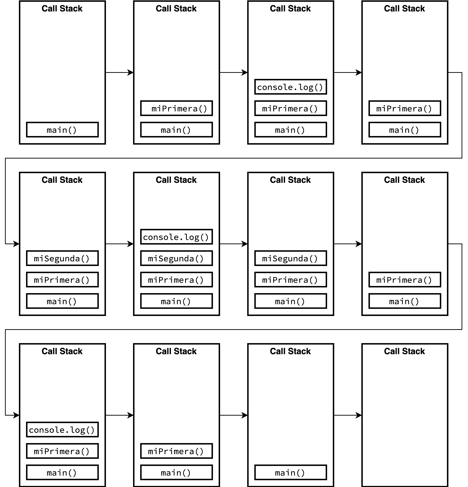
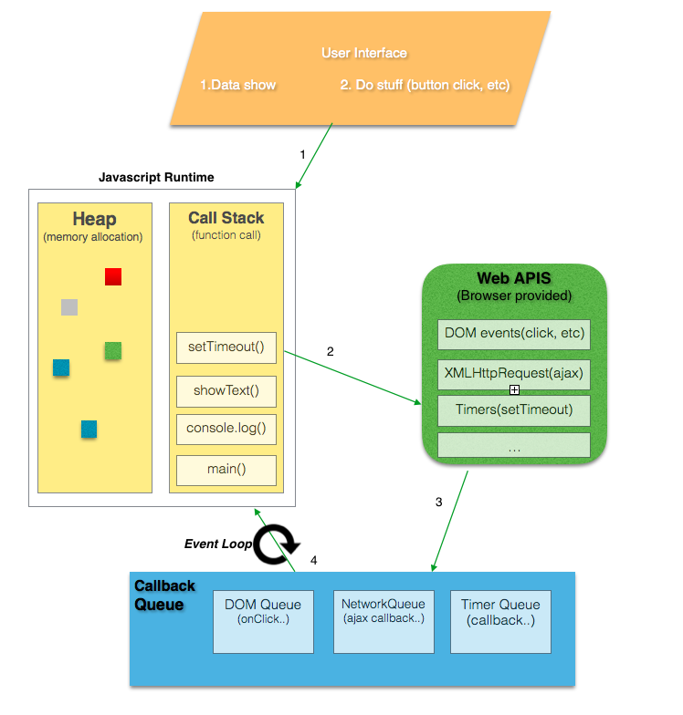

# What is Async?

### Introduction to asynchronicity in JS
Javascript is a single threaded single concurrent language, meaning it can handle one task at a time or a piece of code at a time.
It has a single call stack which along with other parts like heap, queue constitutes the Javascript Concurrency Model (implemented inside of V8)


1.Call Stack : It’s a data structure which records the function calls, basically where in the program we are. 
If we call a function to execute , we push something on to the stack, and when we return from a function, we pop off the top of the stack.

```
const miSegunda = () => {
  console.log('code from second func');
}

const miPrimera = () => {
  console.log('Runs before executing miSegunda()');
  miSegunda();
  console.log('Runs after executing miSegunda()');
}

miPrimera()
```




You all must have seen the long red error stack trace sometimes in our browser console, that basically indicates the current state of the call stack and where in the function it failed in a top to bottom manner just like stack. Sometimes, we get into an infinite loop as we call a function multiple times recursively and as for Chrome browser, there is a limit on the size of the stack which is 16,000 frames , more than that it will just kill things for you and throw Max Stack Error Reached.

2.Heap : Objects are allocated in a heap i.e mostly unstructured region of memory. All the memory allocation to variables and objects happens here.

3.Queue : A JavaScript runtime contains a message queue, which is a list of messages to be processed and the associated callback functions to execute. When the stack has enough capacity, a message is taken out of the queue and processed which consists of calling the associated function (and thus creating an initial stack frame). The message processing ends when the stack becomes empty again. In basic words , these messages are queued in response to external async events(such as a mouse being clicked or receiving the response to an HTTP request), given a callback function has been provided. If, for example a user were to click a button and no callback function was provided — no message would have been enqueued.

**Event loop**

The event loop's job is to look at the stack and look at the task queue. If the stack is empty it takes the first thing on the queue and pushes it on to the stack which effectively run it.




